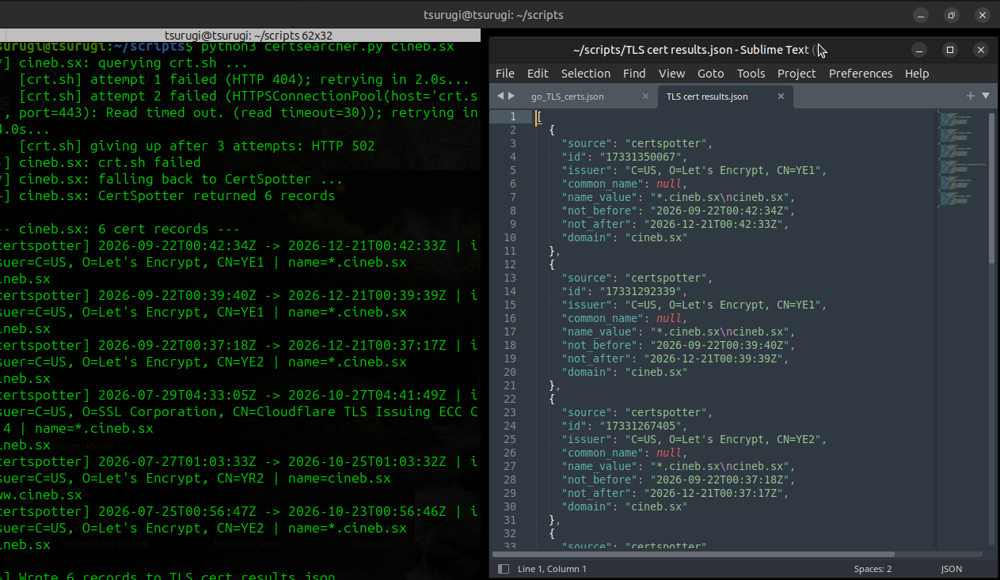

# CertSearcher
A python based recon tool for pulling TLS certificate history from Certificate Transparency logs, built for OSINT/threat-intel workflows where you need to point it at a domain (or a list of them) and get reliable results without babysitting flaky APIs.

## Why this exists

crt.sh is the standard source for CT log queries, but its backend is notoriously overloaded and returns 503s constantly under load. This script retries crt.sh with exponential backoff, and if it's still down, automatically falls back to CertSpotter's API meaning a single crt.sh outage doesn't block your recon.

## Features

Retry/backoff against crt.sh's frequent 503s
Automatic CertSpotter fallback if crt.sh fails entirely, with full pagination (walks every page, not just the first)
Batch mode - point it at a file of domains, one per line
Subdomain extraction - pull unique hostnames from cert SANs across a domain's cert history, useful for infra mapping
JSON/CSV export, auto-numbered by default (TLS cert results.json, _2, _3, etc) so repeated runs never overwrite prior results
Zero setup beyond pip install requests

## Usage

Single target:
```bash
python3 certsearcher.py example.com
python3 certsearcher.py example.com --wildcard --json out.json
python3 certsearcher.py example.com --subdomains
```

Batch mode:
```bash
python3 certsearcher.py -f targets.txt --subdomains --out-dir ./recon
```

## Install
```bash
git clone <repo-url>
cd certsearcher
pip install -r requirements.txt
```

## Example



## Known limitations

CertSpotter's free API only returns unexpired certs meaning it has no way to include historical/expired issuances, so it's a "what's live right now" fallback, not a full history replacement for crt.sh
crt.sh has no documented result cap, but very large domains can still time out on their end regardless of retries
